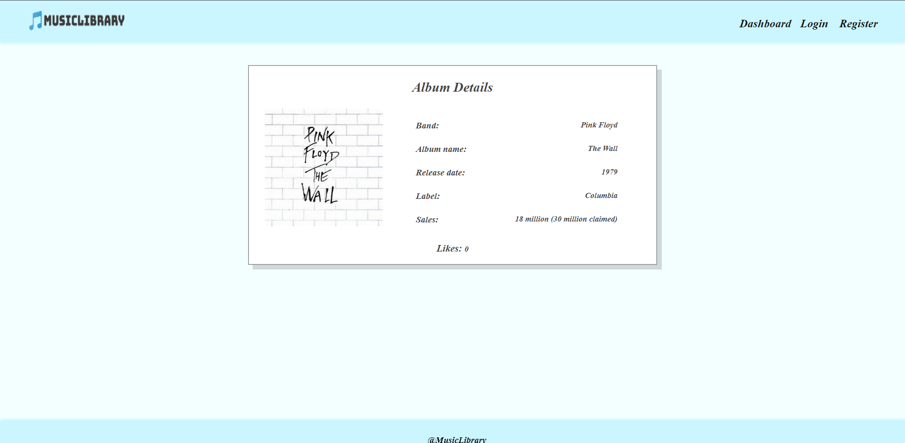

# Music Library

## Overview
**Music Library** is a front-end app (**SPA**) for **creating** and **managing** music albums.
The **application** allows **visitors** to **browse** through the **albums catalog**. **Users** may **register** with an **email** and **password** which allows them to **ctreate** their **own album card**. **Album authors** can also **edit** or **delete** their own **publications** at any time.

The **SPA**"**Music Library**" is an app fro creating **catalog** of **albums**.
  - Technologies: JavaScript, HTML,CSS,Node.js,Express.js,Mocha,Chai

## Pages and permissions

**All users** :lock:
- :pushpin: Home `/home`

- :pushpin: DashBoard `dashboard`

- :pushpin: Details `/details/:id` 

- :pushpin: Login `/login`

- :pushpin: Register `/register`

## Authentication users :lock_with_ink_pen:

- :pushpin: Dashboard `/dashBoard`
- :pushpin: Add Album (Singer/Band + Album + Image URL + Release date + Label + Sales): `/create`
- :pushpin: Album Details: `/details/:id`
- :pushpin:Edit Album(only if user is owner): (Singer/Band + Album + Image URL + Release date + Label + Sales): `/edit/:id`
- :pushpin: Delete Album (only if user is owner): `/delete/:id`

## How to start the application?

-:pushpin: First you must install all dependencies included in the **package.json** file by typing `npm install` in a **terminal**. Then you must **serve** the app by typing `ng serve` in the **terminal**. After that Music Library clould be accessed on http:/localhost:3000 URL.

## Executing the Tests

Before running the test suite, make sure a **web server** is **operational**, and the application can be found at the **root** of its **network address**. To **start**  the included **dev-server**, open a **terminal** in the folder containing **package.json** and execute: `npm run start`

This is a one-time operation unless you **terminate** the **server** at any point. It can be **restarted** with the same command as above. To **execute** the **test**, open a new terminal (do not close the terminal, running the web server instance) in the folder containing **package.json** and execute: `npm run test`

**Test result** will be desplayed in the **terminal**, along detailed information about encountered problems. 
You can perform this operation as many times as it is necessary by re-running the above command.

## Music Library RESTful API

When the app is started locally, RESTful API documentation is available on : http://localhost:3300/api-docs

The following enpoints are supported:

• `GET /data/albums?sortBy=_createdOn%20desc` - list all albums
• `GET /data/albums/:id` - returns an album by given id
• `POST /data/albums` - create a new album (post a JSON object in the request body, e.g. `{ "singer": "Taylor Swift", album": "Midnights", imageUrl":`
`"https://upload.wikimedia.org/wikipedia/en/9/9f/Midnights_-_Taylor_Swift.png", "release":`
`"October 21, 2022", "label": "Republic", "sales": "1.58 million copies"})`
`PUT /data/albums/:id - edit album by id (send a JSON object in the request body, holding all field e.g. "singer": "Taylor Swift", album": "Midnights", imageUrl":`
`"https://upload.wikimedia.org/wikipedia/en/9/9f/Midnights_-_Taylor_Swift.png", "release":`
` "October 21, 2022", "label": "Republic", "sales": "1.58 million copies" })`
• `DELETE /data/albums/: id` -delete album by id
· `POST /users/login` - logs in an existing user (send a JSON object in the request body, holding all fields, e.g. `{"username": "username", "password": "pass123"}`)

## Music Library API

